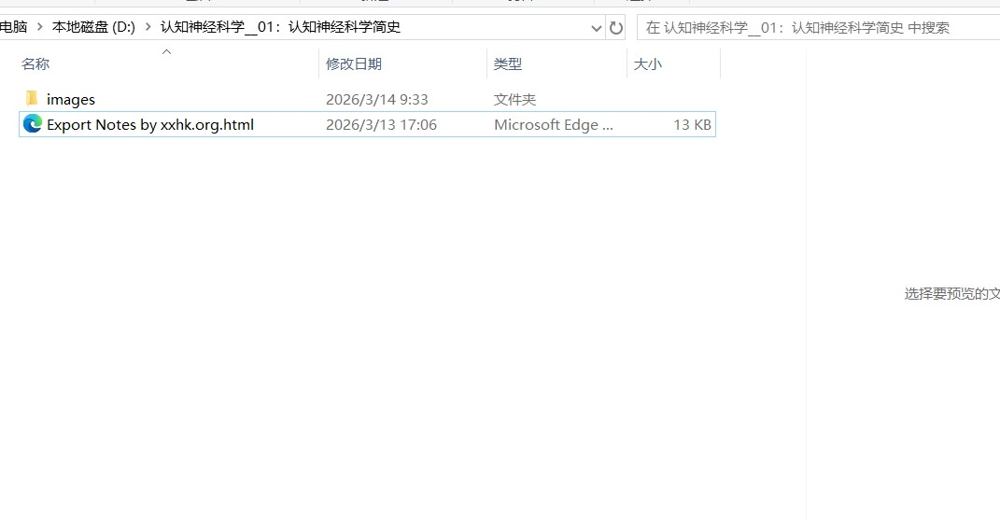
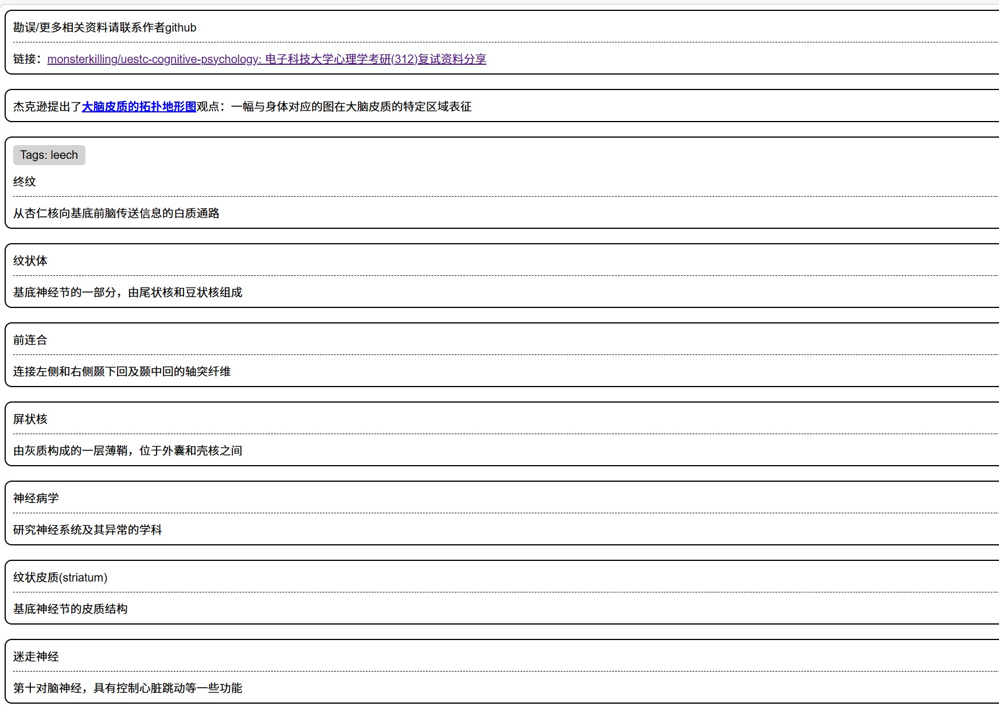

# 电子科技大学心理学考研（312）复试资料分享
### 本仓库包含电子科技大学心理学考研复试所用到的课本（认知神经科学）以及自己总结的相关资料
>本仓库分享的资料仅供学习使用，如果涉及侵权，请联系作者删除

使用方法：
 
1.下载相应章节的文件夹，每个文件夹包含图片文件和html文件。

2.点击html文件，即可看到相关笔记

3.Releases里的压缩包包含了所有的笔记，可以直接下载
[安装包链接](https://github.com/monsterkilling/uestc-cognitive-psychology/releases/tag/%E8%AE%A4%E7%9F%A5%E7%A5%9E%E7%BB%8F%E7%A7%91%E5%AD%A6%E7%9F%A5%E8%AF%86%E7%82%B9%E6%80%BB%E7%BB%93)
